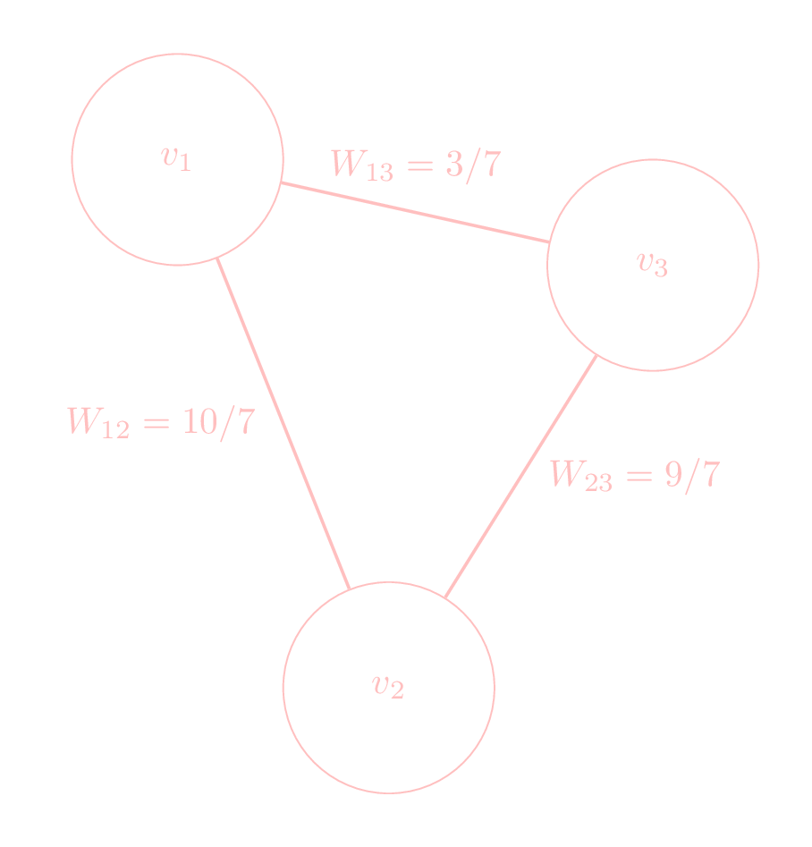
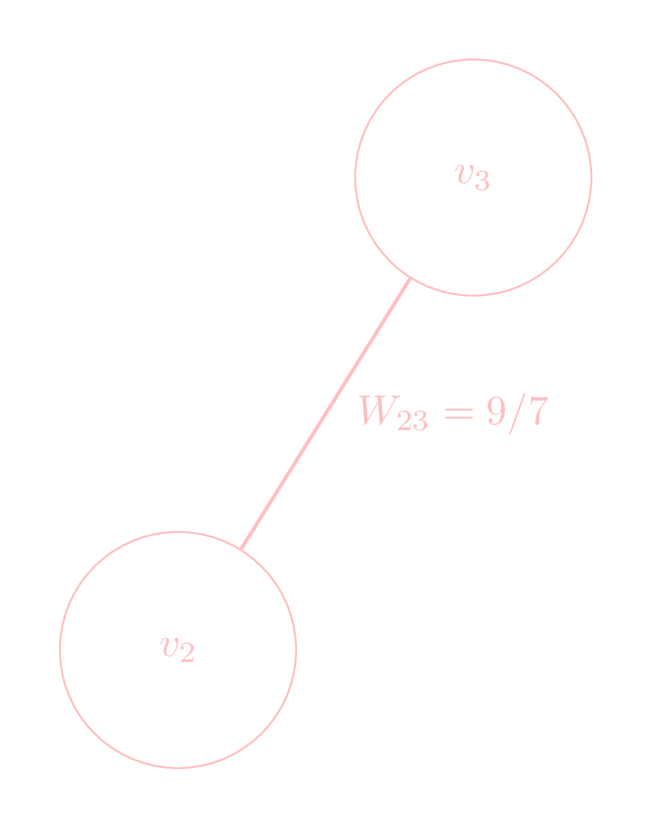
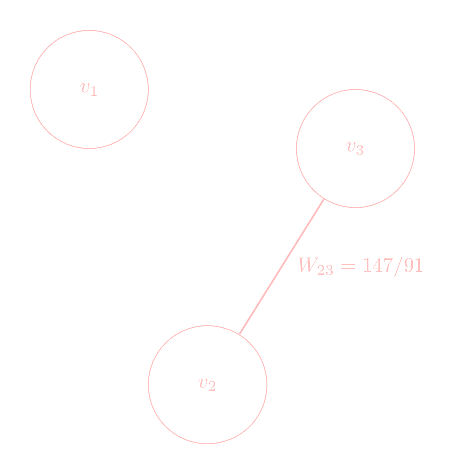
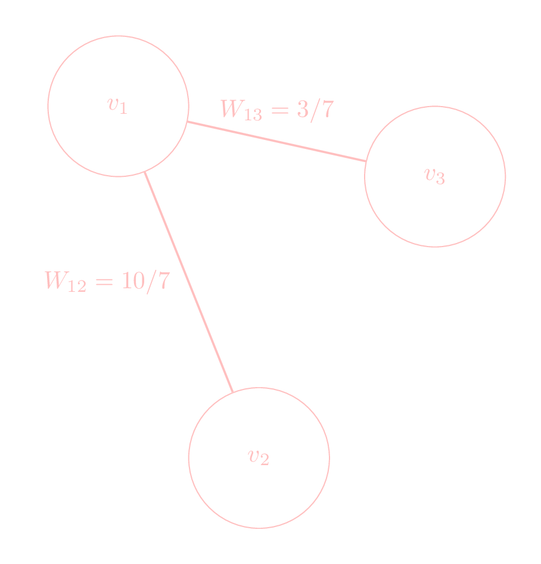
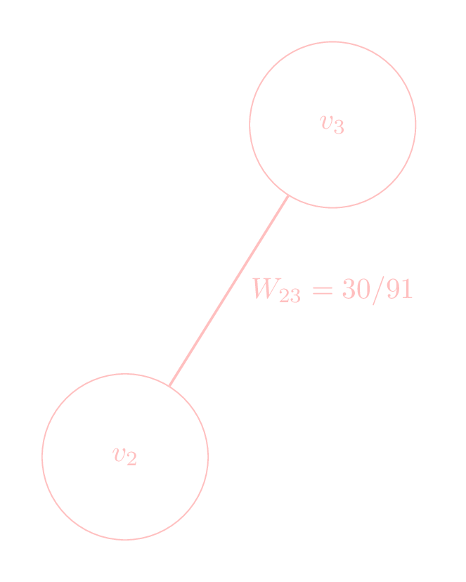
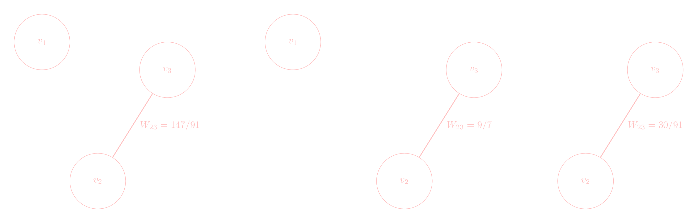

# Sampled Cholesky Decompositions for Graphs

Fundamentally, a Cholesky Decomposition of a sparse matrix is not guaranteed to
maintain sparsity, which can result in expensive memory-related operations in
generating and manipulating the factors of the Cholesky decomposition.

When we look at the Cholesky Decomposition of a Graph Laplacian, this loss of
sparsity has a nice interpretation as adding specific weighted edges to the
graph that underlies the Graph Laplacian. Thus, one way to avoid the loss of
sparsity is to sample the edges that are being added to the graph.

!!! note

    This notion of adding edges to a graph is formalized using weighted multi-
    edge graphs. While such formality may be mathematically appropriate, it
    seems to detract from our ability to understand the simple ideas that
    lead to Sampled Cholesky Decompositions.

Our starting point will be to reinterpret the Cholesky Decomposition of a Graph
Laplacian as a process of manipulating the edges of the underlying graph.
Once we understand this perspective, we will see that Cholesky Decomposition of
a Graph Laplacian can be interpreted as a two step procedure:

1. Removing a node from the graph, and all of the edges connected to the node.
2. Accounting for this loss, by modifying the edges between the neighbors of the removed node.

Furthermore, we will see that it is this second step that causes the loss of
sparsity in the Cholesky Decomposition of a Graph Laplacian. Therefore, by
sampling only a subset of connections between the neighbors of the removed node,
we will create a **Sampled Cholesky Decomposition** that behaves well in
practice.

We will begin by understanding how we can interpret the Cholesky Decomposition
of a Graph Laplacian as the aforementioned two step procedure. Then, we will discuss how we can generate
**Sampled Cholesky Decompositions**, and `SparseCholesky`, specifically.

## Cholesky Decompositions of Graph Laplacians

Suppose $L$ is a Graph Laplacian matrix. Recall that the hallmarks of a Graph
Laplacian: the diagonal entries are non-negative; the off diagonal entries are
non-positive; the matrix is symmetric; and the sum of the off-diagonal entries
of either a column or a row equals the value in the negative of the diagonal
entry. This ultimate feature can be written as

$$L_{ii} = \sum_{j : j \neq j} |L_{ij}| = \sum_{j : j \neq i} |L_{ji}|.$$

Suppose now, in specifying our Graph Laplacian, we decide that we no longer
want the first node in the Graph Laplacian. Then, one simple way of
updating $L$ to reflect this change is to delete the row and column corresponding
to the node that we are to remove, and add the edge weights corresponding to the
node back into the diagonal.

In mathematical notation, if we write

$$L = \begin{bmatrix}
L_{11} & A_1' \\
A_1 & L^{(2)}
\end{bmatrix},$$

then the new Graph Laplacian, $\tilde L$, corresponding to removing the first
node is

$$\begin{aligned}
\tilde L &= \begin{bmatrix} L_{11} &  A_1' \\
A_1 & L^{(2)}
\end{bmatrix} -
\begin{bmatrix}
L_{11} & A_1' \\
A_1 & -\mathrm{Diag}(A_1)
\end{bmatrix} \\
&= \begin{bmatrix}
0 & 0 \\
0 & L^{(2)} + \mathrm{Diag}(A_1)
\end{bmatrix},
\end{aligned}$$

where $\mathrm{Diag}(A_1)$ is the diagonal matrix whose entries are the entries
of $A_{1}$. Notice, the term that we remove from $L$ is a Graph Laplacian:
- The diagonal entries are non-negative ($A_1$ is has non-positive values)
- The off diagonal entries are non-positive
- The sum of the off-diagonal entries is the negative of the diagonal entry.

To demonstrate this consider

$$L = \begin{bmatrix}
13/7 & -10/7 & -3/7 \\
-10/7 & 19/7 & -9/7 \\
-3/7 & -9/7 & 12/7
\end{bmatrix},$$

which corresponds to the weighted graph

If we remove the first row (and first column), the, according to the formula,
the new Graph Laplacian is

$$\begin{aligned}
\tilde L &= \begin{bmatrix}
13/7 & -10/7 & -3/7 \\
-10/7 & 19/7 & -9/7 \\
-3/7 & -9/7 & 12/7
\end{bmatrix} -
\begin{bmatrix}
13/7 & -10/7 & -3/7 \\
-10/7 & 10/7 & 0  \\
-3/7 & 0 & 3/7
\end{bmatrix} \\
&= \begin{bmatrix}
0 & 0 & 0 \\
0 & 9/7 & -9/7 \\
0 & -9/7 & 9/7
\end{bmatrix},
\end{aligned}$$

which we see is a bona fide Graph Laplacian matrix, and corresponds to the
weighted graph

In general, we are often not interested in simply removing a row from a Graph
Laplacian matrix, but rather we are interested in *eliminating the effect* of a
given row from the Graph Laplacian, while still maintaining the Graph Laplacian
structure for the remaining entries of the original Graph Laplacian.

Unfortunately, removing a row is not the same as eliminating the effect of a row,
but it is closely related: we will see that we will remove the row as we have
done above, and then compensate for it by adding edges or changing the weights of
the reduced Graph Laplacian.

One way of achieving this elimination while still maintaining the Graph Laplacian
structure is to use the [Cholesky Decomposition](../cholesky/). In the
scalar Cholesky Decomposition, we recall that we incrementally constructed the
Cholesky Decomposition one diagonal entry at a time. For instance, the first step
of the scalar Cholesky Decomposition of the $d \times d$ Graph Laplacian $L$ is

$$L = \begin{bmatrix}
1 & 0 \\
A_1/L_{11} & I_{d-1}
\end{bmatrix}
\begin{bmatrix}
L_{11} & 0 \\
0 & L^{(2)} - \frac{1}{L_{11}}A_1 A_1'
\end{bmatrix}
\begin{bmatrix}
1 & A_1'/L_{11} \\
0 & I_{d-1}
\end{bmatrix}.$$

Through this first step of the scalar Cholesky Decomposition, we
have a produced a block Diagonal matrix with two blocks, a scalar block $L_{11}$
and a $(d-1) \times (d-1)$ block $L^{(2)} - \frac{1}{L_{11}}A_1A_1'$. We can
interpret this diagonal block as the elimination of the effect of the first row
on the remaining rows of the Graph Laplacian:

- The behavior of the scalar block is completely separate from the behavior of the $(d-1) \times (d-1)$ block, and
- We have accounted for this loss of the first row using the Schur Complement of $L$ with respect to $L_{11}$.

In our example, the scalar Cholesky Decomposition produces a the block diagonal
matrix

$$\begin{aligned}
&\begin{bmatrix}
13/7 & 0 & 0 \\
0 & 19/7 & -9/7 \\
0 & -9/7 & 12/7
\end{bmatrix} -
\frac{7}{13}
\begin{bmatrix}
0 \\
-10/7 \\
-3/7
\end{bmatrix}
\begin{bmatrix}
0 & -10/7 & -3/7
\end{bmatrix} \\
&=\begin{bmatrix}
13/7 & 0 & 0 \\
0 & 19/7 & -9/7 \\
0 & -9/7 & 12/7
\end{bmatrix} -
\begin{bmatrix}
0 & 0 & 0 \\
0 & 100/91 & 30/91 \\
0 & 30/91 & 9/91
\end{bmatrix} \\
&= \begin{bmatrix}
13/7 & 0 & 0 \\
0 & 147/91 & -147/91 \\
0 & -147/91 & 147/91
\end{bmatrix},
\end{aligned}$$

which "corresponds" to the weighted graph represented by

An important observation gleaned from this example is $L^{(2)} -
\frac{1}{L_{11}}A_1A_1'$ is still a Graph Laplacian.
To see this formally, define
$$\mathcal{L}^{(1)} =
\begin{bmatrix}
L_{11} & A_1' \\
A_1 & -\mathrm{Diag}(A_1)
\end{bmatrix},$$

where $\mathrm{Diag}(A_1)$ is a diagonal matrix whose diagonal entries are the
components of $A_1$. Notice, $\mathcal{L}^{(1)}$ is the Graph Laplacian that
corresponds to the first row and column of the original Graph Laplacian.

In our example,
$$\mathcal{L}^{(1)} = \begin{bmatrix}
13/7 & -10/7 & -3/7 \\
-10/7 & 10/7 & 0 \\
-3/7 & 0 & 3/7
\end{bmatrix},$$
which corresponds to the weighted graph

Such graphs actually have a special name: they are called **star graphs** as
the edges emanate from a single node and make a vaguely star shaped image.

Using $\mathcal{L}^{(1)}$, we can write the block diagonal in the Cholesky
Decomposition as
$$\begin{aligned}
\begin{bmatrix}
L_{11} & 0 \\
0 & L^{(2)}- \frac{1}{L_{11}} A_1 A_1' \end{bmatrix} &=
\begin{bmatrix}
L_{11} & 0 \\
0 & 0
\end{bmatrix} + L -
\frac{1}{L_{11}} \begin{bmatrix} L_{11} \\ A_1 \end{bmatrix}
\begin{bmatrix} L_{11} & A_1' \end{bmatrix} \\
&= \begin{bmatrix}
L_{11} & 0 \\
0 & 0
\end{bmatrix} + (L - \mathcal L^{(1)}) + \left( \mathcal L^{(1)} -
\frac{1}{L_{11}} \begin{bmatrix} L_{11} \\ A_1 \end{bmatrix}
\begin{bmatrix} L_{11} & A_1' \end{bmatrix} \right)
\end{aligned}$$

Notice, the first term in the summation corresponds to the weight of the first
row of the original Graph Laplacian. The second term in the sum corresponds to
removing the first row (i.e., it is $\tilde L$). The last term in the sum
is
$$\begin{bmatrix}
L_{11} & A_1' \\
A_1 & -\mathrm{Diag}(A_1)
\end{bmatrix} - \frac{1}{L_{11}} \begin{bmatrix} L_{11} \\ A_1 \end{bmatrix}
\begin{bmatrix} L_{11} & A_1' \end{bmatrix} = \begin{bmatrix}
0 & 0 \\
0 & -\mathrm{Diag}(A_1) - \frac{1}{L_{11}} A_1 A_1'
\end{bmatrix},$$
which we can verify is a Graph Laplacian.

In our example, the third term is
$$\begin{bmatrix}
0 & 0 & 0 \\
0 & 30/91 & -30/91 \\
0 & -30/91 & 30/91
\end{bmatrix},$$
which corresponds to the weighted graph

In our example, the sum of these three terms is

$$\begin{bmatrix}
13/7 & 0 & 0 \\
0 & 147/91 & -147/91 \\
0 & -147/91 & 147/91
\end{bmatrix} = \begin{bmatrix}
13/7 & 0 & 0 \\
0 & 0 & 0 \\
0 & 0 & 0
\end{bmatrix} + \begin{bmatrix}
0 & 0 & 0 \\
0 & 100/91 & 30/91 \\
0 & 30/91 & 9/91
\end{bmatrix}  + \begin{bmatrix}
0 & 0 & 0 \\
0 & 30/91 & -30/91 \\
0 & -30/91 & 30/91
\end{bmatrix},$$

which we can interpret as the "sum of graphs" as depicted by

The last term is adding additional edge weights between the neighbors of the
removed node. Such
a graph is called a **clique graph**, and we will see it play a more prominent
role in our more complex example in the next section. For now, this clique graph
is actually the root cause of losing sparsity: when we eliminate a node using
the cholesky decomposition, we remove its star graph but then replace it with
the clique graph between the neighbors of the removed node. If the neighbors
were not previously connected, then we have connected them through the Cholesky
decomposition, which results in a loss of sparsity. The next example illustrates
this more meaningfully.

## Example of Cholesky on a Graph
